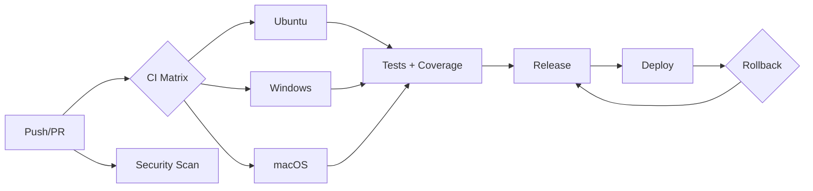

# Proyecto Final: CI/CD Completo Multi-Plataforma (Python)

Este repo contiene:

1. **Aplicación simple en Python** con:
   - Pruebas unitarias (pytest)
   - Logs del sistema (logging)
   - Interacción con el sistema de archivos
2. **Pipeline CI/CD** (`.github/workflows/ci-pipeline.yml`) en matriz de SO (Ubuntu, Windows, macOS), instala dependencias específicas del SO, ejecuta pruebas y genera reportes de cobertura.
3. **Security scan** (`security-scan.yml`) con Bandit (SAST) y Safety (dependencias).
4. **Release automático** (`release.yml`) que empaqueta y crea un GitHub Release.
5. **Deploy automático** (`deploy.yml`) que publica una página simple en GitHub Pages (puede adaptarse a otros targets).
6. **Estrategia de rollback** documentada en `ROLLBACK.md`.

## Ejecutar localmente
```bash
python -m venv .venv
source .venv/bin/activate  # Windows: .venv\Scripts\activate
pip install -r requirements.txt
python app/main.py
pytest
coverage run -m pytest && coverage report -m && coverage xml
```

## Diagrama (Mermaid)

